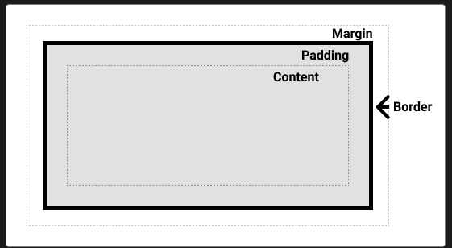

# Visual formatting model

문서에서 요소를 화면에 어떻게 표현할지에 대한 모델을 정의한다.

## normal flow

box모델을 갖는다.

-   containing block
-   block formatting contexts
-   inline formatting contexts
-   relative positioning

### containing block

normal flow의 일부분이다.
요소가 normal flow를 벗어나면 해당 요소에 대한 새로운 containing block이 형성되거나 부모의 containing block에 영향을 받을 수 있다.

레이아웃을 형성하는 요소에 대한 개념
요소의 크기, padding, margin, position은 containing block에 영향을 받는다.

block, float, inline 요소들의 width, height, margin을 계산하며
position을 갖는 요소들의 위치 값에 영향을 준다.

쉽게 말해 어떤 요소의 부모 요소

-   position이 static, relative, sticky에 해당하는 요소의 containing block은 가장 가까운 조상 요소의 content box edge다.

-   position이 absolute인 경우 containing block은 가장 가까운 조상요소의 padding box edge로 형성된다.
    (조상 요소는 static이 아는 position 값을 가져야 한다.)

-   만약 position이 absolute, fixed일 때 해당 조상 요소가

    -   transform 또는 perspective값이 none이 아닌 경우 containing block이 형성된다.
    -   will-change 값이 transform, perspective를 갖는 경우 형성된다.
    -   filter 값이 none이 아닐 경우 containing block이 형성 된다.
    -   container-type이 normal이 아닐경우
    -   backdrop-filter 값이 none이 아닐 경우

    해당 부모의 padding box가 containing block으로 작용 할 수 있다.

## visual formatting context

### block formatting context

-   레이아웃을 관리한다.
-   float, clear, margin 충돌, overflow 처리와 같은 레이아웃 이슈를 제어 한다.
-   bfc에서 box는 containing block의 상단에서 시작하여 수직 배치 된다.
-   bfc에서 각 box의 왼쪽 외부 가장자리는 containing block의 왼쪽 가장자리에 닿는다.

#### bfc 생성 방법

-   문서의 루트 요소
-   float이 none이 아닐 때
-   position이 absolute, fixed일 떄
-   inline-block;
-   table-cell, table-caption 등 table 관련 속성일 때
-   overflow가 visible,clip이 아닌 경우
-   display: flow-root
-   contain: layout, content, or paint
-   flex-item
-   multi column

### inline formatting context

-   containing block의 상단에서 시작해 하나씩 수평으로 배치 된다.

## float

## absolute positioning
